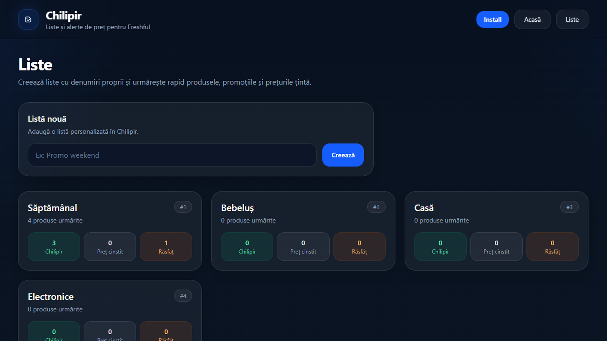
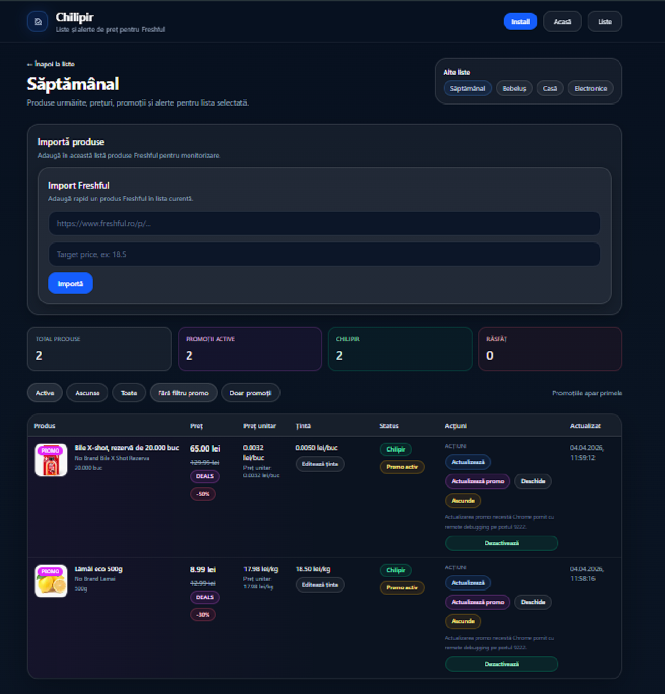

# price-watch-ro / Chilipir

[](https://github.com/CyberXecure/price-watch-ro/releases)
[](https://github.com/CyberXecure/price-watch-ro/blob/main/LICENSE)
[](https://github.com/CyberXecure/price-watch-ro/commits/main)

Chilipir este o aplicație local-first pentru liste și monitorizare de prețuri, construită în jurul unui workflow simplu: import de produse, watchlists, refresh local și comparație de preț per unitate.

În stadiul actual, proiectul este orientat în special spre produse Freshful, dezvoltare locală și iterație rapidă pe fluxurile de refresh static și rendered.

## Status

Proiectul este în stadiu beta / MVP.

Repository-ul public reflectă structura reală a proiectului și workflow-ul local folosit în dezvoltare. În forma actuală, focusul este pe rulare locală, testare manuală, validare a fluxurilor de refresh și polish incremental al UI-ului și al parserelor.

## Ce face în prezent

- importă produse din URL
- menține watchlists locale
- urmărește preț total și preț unitar
- permite setarea unui target price
- clasifică produsele în:
  - **Chilipir**
  - **Preț cinstit**
  - **Răsfăț**
- oferă refresh static și refresh rendered pentru promoții și validare de preț
- rulează local atât în modul web, cât și în modul desktop dev

## Stack

- **Frontend:** Next.js
- **Backend:** FastAPI
- **Desktop:** Tauri
- **Frontend language:** TypeScript / React
- **Backend language:** Python
- **Tooling local:** PowerShell, Chrome remote debugging, Cargo
- **Target workflow:** local-first development and testing

## Structura repository-ului

```text
apps/
  web/                 frontend-ul web

services/
  api/                 backend-ul FastAPI
  app_desktop/         componente auxiliare pentru runtime desktop

desktop/
  src-tauri/           aplicația desktop Tauri

scripts/
  dev/                 scripturi locale pentru start / stop
```

## Cerințe

Pentru dezvoltare locală pe Windows:

- PowerShell 7
- Python 3.12+
- Node.js + npm
- Rust + Cargo
- Google Chrome instalat

## Workflow recomandat

### 1. Web + API

Pornire:

```powershell
.\scripts\dev\start-local.ps1
```

Oprire:

```powershell
.\scripts\dev\stop-local.ps1
```

Scriptul de start încearcă să:

- pornească Google Chrome cu remote debugging pe portul `9222`
- pornească API-ul desktop local la `http://127.0.0.1:18400`
- pornească frontend-ul local la `http://localhost:3000`
- folosească `3001` dacă `3000` este ocupat
- curețe procese vechi și lock-ul Next.js dacă este necesar

### 2. Desktop dev (Tauri + Web + API)

Pornire:

```powershell
.\scripts\dev\start-desktop-dev.ps1
```

Oprire:

```powershell
.\scripts\dev\stop-desktop-dev.ps1
```

Acest workflow pornește tot stack-ul local și apoi deschide aplicația desktop în mod development.

## Endpoint-uri utile

### Health

```powershell
Invoke-RestMethod -Uri "http://127.0.0.1:18400/health" -Method Get
```

### Health promo engine

```powershell
Invoke-RestMethod -Uri "http://127.0.0.1:18400/health/promo-engine" -Method Get | ConvertTo-Json -Depth 6
```

### Watchlist items detailed

```powershell
Invoke-RestMethod -Uri "http://127.0.0.1:18400/watchlists/1/items/detailed" -Method Get
```

## Promo engine / rendered refresh

Fluxul rendered folosește Chrome pornit cu remote debugging pe portul `9222`.

Scripturile locale încearcă să pornească automat Chrome CDP cu profil dedicat:

```text
D:\dev\chrome-freshful-debug
```

Verificare manuală:

```powershell
Invoke-RestMethod -Uri "http://127.0.0.1:9222/json/version" -Method Get
```

Dacă promo engine nu este disponibil, rendered refresh poate eșua până când Chrome este pornit corect cu CDP activ.

## Endpoint-uri API utile

- `GET /health`
- `GET /health/promo-engine`
- `GET /watchlists/with-summary`
- `GET /watchlists/{id}/items/detailed`
- `POST /watchlists/{id}/items/{item_id}/refresh`
- `POST /watchlists/{id}/items/{item_id}/refresh-rendered`
- `POST /imports/freshful-url-auto`
- `POST /imports/freshful-url-debug`

## Frontend only

Dacă vrei să rulezi doar frontend-ul:

```powershell
cd .\apps\web
npm install
$env:NEXT_PUBLIC_API_BASE = "http://127.0.0.1:18400"
npm run dev
```

## Backend only

Dacă vrei să rulezi doar backend-ul desktop API:

```powershell
cd .\services\api
.\.venv\Scripts\python.exe .\run-desktop.py
```

## Screenshots

### Privire generală asupra listelor



### Detalii listă și produse urmărite



## Variabile de mediu

Repository-ul include fișiere și configurări orientate spre rulare locală.

Exemplu important pentru frontend:

```env
NEXT_PUBLIC_API_BASE=http://127.0.0.1:18400
```

## Observații de dezvoltare

- API-ul desktop rulează pe `18400`
- frontend-ul dev rulează de regulă pe `3000`
- dacă `3000` este ocupat, Next.js poate porni pe `3001`
- refresh-ul rendered depinde de Chrome CDP pe `9222`
- disponibilitatea produselor poate veni din static parsing, iar datele promo pot fi completate din rendered parsing
- artefactele Tauri și fișierele de build nu trebuie versionate în Git

## Git ignore recomandat

Asigură-te că `.gitignore` conține cel puțin:

```gitignore
*.bak
*.bak*
*.checkpoint*
desktop/src-tauri/target/
*.pdb
*.msi
*.exe
```

## Limitări actuale

În starea actuală:

- proiectul este orientat în primul rând spre dezvoltare locală
- unele fluxuri depind de un mediu local deja pregătit
- anumite zone sunt încă în curs de polish
- parserul și rendered flow-ul sunt optimizate incremental, pe baza produselor și cazurilor întâlnite în testare

## Legal

Acest proiect este distribuit sub licența MIT. Vezi fișierul `LICENSE` pentru detalii.

## Disclaimer

Acest proiect este un proiect independent și experimental.

Nu este afiliat oficial cu magazine, platforme comerciale sau servicii terțe care pot apărea în logica aplicației, în exemple sau în fluxurile de testare.

Utilizarea proiectului și adaptarea lui pentru alte surse, fluxuri sau scopuri rămân responsabilitatea utilizatorului.

## AI assistance disclosure

Ideea, direcția produsului și deciziile de selecție aparțin autorului proiectului.

Arhitectura, implementarea și documentația au fost realizate cu asistență AI în diferite etape ale dezvoltării. Codul publicat a fost selectat, ajustat și integrat în proiect de autor.

## Author

Laurentiu Iulian Iancu  
a.k.a. CyberXecure
